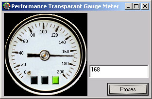



## Gauge Speedo Meter

### Description

I Used this Speedo meter to Visualize the Control panel cockpit in balanced scorecard software
 
### More Info
 

             |
---                |---
**Submitted On**   |2003-03-10 08:10:52
**By**             |[Fusuy The Nidulawa](https://github.com/Planet-Source-Code/PSCIndex/blob/master/ByAuthor/fusuy-the-nidulawa.md)
**Level**          |Intermediate
**User Rating**    |3.3 (20 globes from 6 users)
**Compatibility**  |VB 6\.0
**Category**       |[Graphics](https://github.com/Planet-Source-Code/PSCIndex/blob/master/ByCategory/graphics__1-46.md)
**World**          |[Visual Basic](https://github.com/Planet-Source-Code/PSCIndex/blob/master/ByWorld/visual-basic.md)
**Archive File**   |[Gauge\_Spee1558753132003\.zip](https://github.com/Planet-Source-Code/fusuy-the-nidulawa-gauge-speedo-meter__1-43978/archive/master.zip)

### API Declarations

No API

